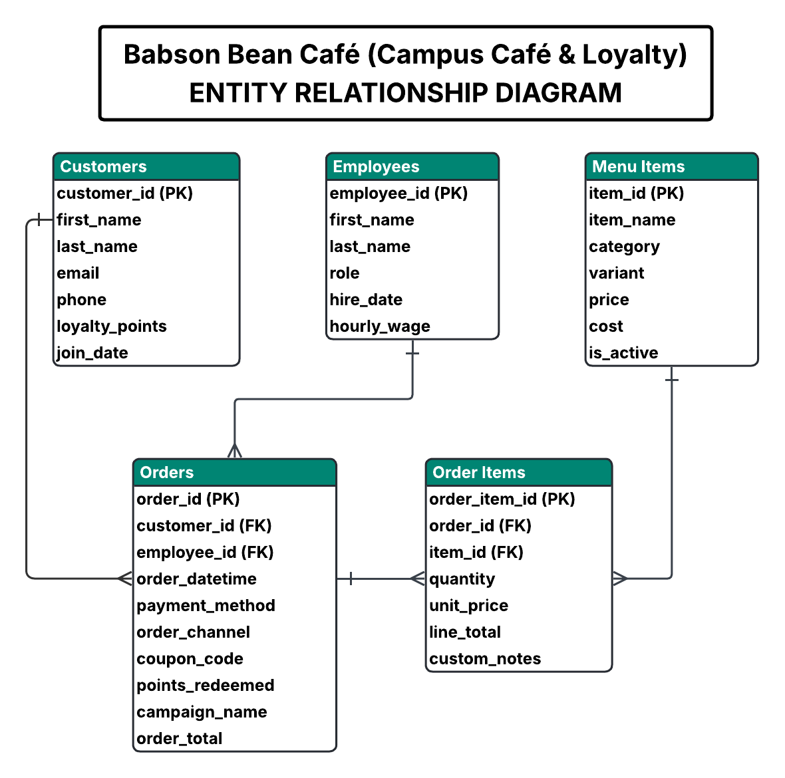

# Babson Bean Café – Database Design (Phase 1)

The Babson Bean Café database unifies sales and loyalty data to enable analysis of best-selling products, high-value customers, and margin trends. The design includes five core entities: **Customers**, **Employees**, **Menu Items**, **Orders**, and **Order Items**.  

- Each **Customer** can place multiple **Orders**, and each **Employee** can process many **Orders**.  
- Each **Order** contains one or more **Order Items**, which link back to the **Menu Items** purchased.  
- The **Order Items** table serves as a junction entity resolving the many-to-many relationship between **Orders** and **Menu Items**.  

Attributes include customer loyalty points, menu item cost and price for margin analysis, and payment details for order tracking.  
Data types are kept practical: identifiers are integers, monetary values are decimals, dates use standard date/time types, and logical flags (e.g., product availability) use booleans.  

This structure supports queries on product performance, customer engagement, and café sales trends as part of the Babson Bean Café’s digitization initiative.

---

### Attribute Type Summary

Data types were chosen to keep the design practical and consistent with typical SQL usage:

| Entity | Example Attributes | Typical Data Types |
|---------|--------------------|--------------------|
| **Customers** | first_name, last_name, email, phone, loyalty_points, join_date | Text / Integer / Date |
| **Employees** | first_name, last_name, role, hire_date, hourly_wage | Text / Date / Decimal |
| **Menu Items** | item_name, category, variant, price, cost, is_active | Text / Decimal / Boolean |
| **Orders** | order_datetime, payment_method, order_channel, coupon_code, order_total | DateTime / Text / Decimal |
| **Order Items** | quantity, unit_price, line_total, custom_notes | Integer / Decimal / Text |

Primary and foreign keys use **INTEGER** identifiers for simplicity, and monetary amounts use **DECIMAL(10,2)** for accurate currency storage.

---

### Entity-Relationship Diagram

