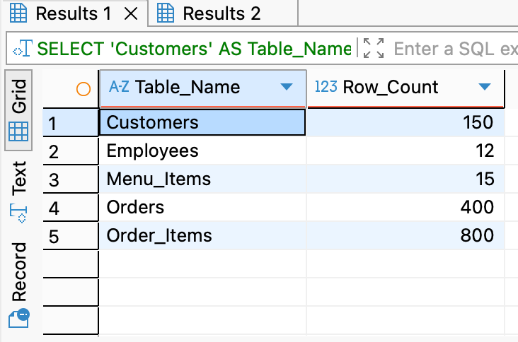

# Babson Bean Café Database Project  
_OIM6301 – Programming for Business Analytics_  
**Student:** Priyanka Tambe  

---

## 1. Scenario Choice & Rationale
I selected **Scenario C – Babson Bean Café**, which focuses on integrating the café’s fragmented point-of-sale and loyalty data into one relational database.  
The goal is to enable insights into **best-selling menu items, high-value customers, category-level margins, and sales trends** that can inform marketing and inventory decisions.

---

## 2. ERD (Entity-Relationship Diagram)
  
*Figure 1: ERD showing five entities — Customers, Employees, Menu_Items, Orders, and Order_Items — and their relationships.*

---

## 3. Database Design Assumptions & Decisions
- **Primary Keys:** All tables use `INTEGER PRIMARY KEY` (auto-increment).  
- **Foreign Keys:**  
  - `Orders.customer_id → Customers.customer_id`  
  - `Orders.employee_id → Employees.employee_id`  
  - `Order_Items.order_id → Orders.order_id`  
  - `Order_Items.item_id → Menu_Items.item_id`  
- **Data Types:**  
  - `TEXT` for strings/dates (`YYYY-MM-DD` or `YYYY-MM-DD HH:MM`).  
  - `REAL` for prices, costs, and wages.  
  - `INTEGER` for IDs, quantities, and loyalty points.  
- **Constraints:**  
  - `NOT NULL` for required fields such as `item_name`, `order_datetime`, and `payment_method`.  
  - `UNIQUE` on `Customers.email` to prevent duplicates.  
- **Naming Conventions:**  
  - Singular table names with `snake_case` column naming (`order_total`, `loyalty_points`).  
  - Consistent prefixes across scripts and CSVs to simplify mapping.

---

## 4. Data Generation Process
- **Tool Used:** Mockaroo (five schemas — one per entity).  
- **Volume Generated:**  
  - Customers – 150 rows  
  - Employees – 12 rows  
  - Menu_Items – 15 rows  
  - Orders – 400 rows  
  - Order_Items – 800 rows  
- **Referential Integrity:**  
  Foreign-key values in child tables (e.g., `Orders.customer_id`, `Orders.employee_id`, `Order_Items.order_id`, and `Order_Items.item_id`) were generated within valid parent ID ranges to maintain referential integrity.  
- **Date Range:** 2025-09-01 → 2025-10-24, representing roughly two months of café operations.  
- **Enums and Categories:**  
  - `payment_method` = 'cash', 'card', 'mobile'  
  - `category` = 'Coffee', 'Bakery', 'Other'  
  - `role` = 'Barista', 'Manager', 'Cashier'  
- **Data Cleaning:** Ensured UTF-8 encoding, standardized date formats, and verified that all foreign-key values matched valid parent keys before import.

---

## 5. Implementation Steps (SQLite + DBeaver)
1. Created new SQLite connection (`babson_bean_cafe.db`) in DBeaver.  
2. Executed `schema.sql` with `PRAGMA foreign_keys = ON;`.  
3. Verified successful table creation (`view tables.png`, `tables created.png`).  
4. Imported CSVs sequentially — **Customers → Employees → Menu_Items → Orders → Order_Items** — using the Import Wizard.  
5. Checked UTF-8 encoding and header mapping during import.  
6. Verified imports with `SELECT COUNT(*)` queries.  
7. Confirmed referential integrity using orphan-check queries (zero orphan rows).

> *All DDL statements are included in the [`schema.sql`](schema.sql) file, which defines the five tables and their foreign key relationships.  
> All business analysis queries are included in the [`queries.sql`](queries/queries.sql) file, each preceded by a comment describing the business question answered.*  

> *Tools used:* DBeaver 24.x, SQLite 3.x, Mockaroo (web), macOS Sonoma.  
> *Supporting files:* `schema.sql` (DDL) and `queries.sql` (business analysis queries).

---

## 6. Evidence of Successful Imports
All five tables were created and populated successfully.  
Imports were validated using both DBeaver interface and SQL row-count queries.

| Table | Row Count | Import Status |
|:-------------|:-----------:|:----------------|
| Customers | 150 | Imported Successfully |
| Employees | 12 | Imported Successfully |
| Menu_Items | 15 | Imported Successfully |
| Orders | 400 | Imported Successfully |
| Order_Items | 800 | Imported Successfully |

  
*All five tables visible in DBeaver after schema execution.*

  
*Example of successful import for the Customers table.*

  
*SQL query output verifying row counts for all entities.*

```sql
SELECT 'Customers' AS Table_Name, COUNT(*) AS Row_Count FROM Customers
UNION ALL
SELECT 'Employees', COUNT(*) FROM Employees
UNION ALL
SELECT 'Menu_Items', COUNT(*) FROM Menu_Items
UNION ALL
SELECT 'Orders', COUNT(*) FROM Orders
UNION ALL
SELECT 'Order_Items', COUNT(*) FROM Order_Items;

```

All tables returned the expected counts, confirming complete imports and valid foreign-key mappings.

---

## 7. Data Quality Checks
- **Foreign-Key Integrity:** No orphaned `order_id` or `item_id` values.  
- **Nulls:** All `NOT NULL` columns validated.  
- **Numeric Fields:** No negative prices, wages, or quantities.  
- **Encoding:** All files confirmed as UTF-8 CSVs.  

  
*Visual confirmation of foreign-key relationships.*

---

## 8. Analytical Capabilities
The database supports queries answering key business questions such as:  
- Top 3 best-selling menu items (by quantity)  
- High-value customers based on average ticket value  
- Revenue and gross margin by category  
- Loyalty members inactive ≥ 60 days  
- Order distribution by payment method  
- Monthly revenue trend and highest-grossing month  

> The complete SQL for all six required and two original analytical queries is provided in [`queries/queries.sql`](queries/queries.sql), with output screenshots stored in the `/queries/Output for each query/` folder.

These analyses enable Babson Bean Café to optimize inventory, loyalty programs, and staffing decisions based on actual sales and customer data.

---

## 9. Summary & Future Improvements
The Babson Bean Café database provides a robust, normalized foundation integrating sales, staff, and loyalty information.  
It enables efficient SQL analysis and reliable relational integrity.  
The project demonstrates how small businesses can evolve from spreadsheets to a data-driven decision-making system using relational modeling and SQL.

**Future Improvements:**  
- Add inventory tracking and supplier tables for cost control.  
- Integrate promotions and seasonal menu items for deeper trend analysis.  
- Automate daily data exports from the POS system for real-time updates.
